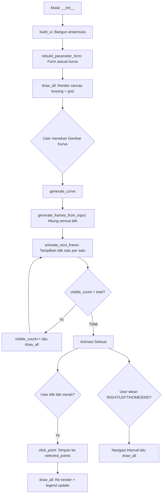

# 📐 Dokumentasi: Representasi Parametrik Kurva Konik

**Nama File:** `projectgrafkom_revisi.py`  
**Bahasa:** Python 3 (Tkinter GUI)  
**Mata Kuliah:** Grafika Komputer — Semester 6

---

## 1. Spesifikasi Aplikasi

| Item | Detail |
|------|--------|
| **Bahasa** | Python 3.x |
| **Library** | `tkinter`, `math` (standar library) |
| **Resolusi Default** | 1200 × 720 px (minimum 1000 × 620) |
| **Jenis Kurva** | Lingkaran, Elips, Parabola, Hiperbola |
| **Metode Rendering** | Parametrik — titik dihitung per interval `t`, lalu dihubungkan garis |
| **Animasi** | Interval digambar satu per satu (45 ms/frame) |
| **Interaksi** | Klik titik, drag canvas, scroll zoom, keyboard shortcut |

---

## 2. Cara Penggunaan

### 2.1 Langkah Dasar
1. Jalankan `python projectgrafkom_revisi.py`
2. Pilih **Jenis Kurva** dari dropdown (Lingkaran / Elips / Parabola / Hiperbola)
3. Atur parameter di panel kiri (pusat, jari-jari, step, dll.)
4. Klik **"Gambar Kurva"** — animasi mulai berjalan
5. Gunakan **Pause/Play** atau **SPACE** untuk menghentikan/melanjutkan
6. Klik **titik merah** pada kurva untuk melihat detail interval

### 2.2 Shortcut Keyboard

| Tombol | Fungsi |
|--------|--------|
| `SPACE` | Play / Pause animasi |
| `RIGHT` | Maju 1 interval |
| `LEFT` | Pindah tanda aktif ke interval sebelumnya |
| `HOME` | Tanda aktif ke interval awal |
| `END` | Tampilkan semua interval sekaligus |
| `R` | Reset semua |
| `UP / DOWN` | Naikkan / turunkan nilai step |
| `+ / -` | Zoom in / out |
| `W / A / S / D` | Geser canvas (atas/kiri/bawah/kanan) |
| `F` | Auto-fit kurva ke canvas |
| `1 / 2 / 3 / 4` | Ganti kurva cepat |

### 2.3 Interaksi Mouse
- **Klik titik merah**: Pilih titik, tampilkan info di panel kiri & legend kanan atas
- **Klik 2 titik berbeda**: Tampilkan sudut, selisih sudut, dan total t
- **Klik 2× titik sama**: Tampilkan total t = step × interval
- **Drag canvas**: Geser tampilan
- **Scroll**: Zoom in/out

### 2.4 Toggle Checkbox
- ☑ **Tampilkan nomor interval** — Nomor di tiap titik (1, 5, 10, ...)
- ☑ **Tampilkan label titik aktif** — Label `t=..., (x, y)` di titik kuning
- ☑ **Tampilkan sin/cos/tan** — Garis putus-putus helper trigonometri
- ☑ **Tampilkan garis sudut** — Ray ungu dari pusat ke titik terpilih

---

## 3. Rumus Parametrik per Kurva

### 3.1 Lingkaran

```
x(t) = xc + r · cos(t)
y(t) = yc + r · sin(t)
t ∈ [0, 2π]
```

| Parameter | Arti | Default |
|-----------|------|---------|
| `xc, yc` | Koordinat pusat | 0, 0 |
| `r` | Jari-jari | 80 |
| `step` | Interval parameter t | 0.08 |

**Karakteristik:** Eksentrisitas `e = 0`, simetri bundar sempurna.

### 3.2 Elips

```
x(t) = xc + a · cos(t)
y(t) = yc + b · sin(t)
t ∈ [0, 2π]
```

| Parameter | Arti | Default |
|-----------|------|---------|
| `a` | Jari-jari horizontal (sumbu mayor/minor) | 100 |
| `b` | Jari-jari vertikal (sumbu mayor/minor) | 55 |
| `step` | Interval parameter t | 0.08 |

**Karakteristik:** `c = √(|a² - b²|)`, eksentrisitas `e = c / max(a,b)`, `0 < e < 1`.

### 3.3 Parabola

```
x(t) = xc + 2·a·t
y(t) = yc + a·t²
t ∈ [t_awal, t_akhir]
```

| Parameter | Arti | Default |
|-----------|------|---------|
| `a` | Koefisien kecekungan | 0.025 |
| `t awal` | Batas bawah parameter | -100 |
| `t akhir` | Batas atas parameter | 100 |
| `step` | Interval parameter t | 2.5 |

**Karakteristik:** Eksentrisitas `e = 1`, vertex di `(xc, yc)`, fokus di `p = 1/(4a)`.

### 3.4 Hiperbola

```
Cabang Kanan:  x(t) = xc + a · sec(t)  = xc + a / cos(t)
Cabang Kiri:   x(t) = xc - a · sec(t)  = xc - a / cos(t)
Kedua cabang:  y(t) = yc + b · tan(t)
t ∈ (-π/2, π/2)  (disesuaikan: t_awal s/d t_akhir)
```

| Parameter | Arti | Default |
|-----------|------|---------|
| `a` | Jarak pusat ke vertex | 45 |
| `b` | Mengatur kemiringan asimtot | 35 |
| `t awal` | Batas bawah parameter | -1.4 |
| `t akhir` | Batas atas parameter | 1.4 |
| `step` | Interval parameter t | 0.05 |

**Karakteristik:** `c = √(a² + b²)`, `e = c/a > 1`, asimtot `y = ±(b/a)(x - xc) + yc`.

> [!NOTE]
> 1 frame hiperbola = 2 titik (cabang kanan + cabang kiri).

---

## 4. Alur Program (Flow)



### Urutan Render (`draw_all`)
Setiap kali `draw_all()` dipanggil, canvas dihapus total lalu digambar ulang:

1. **`draw_grid()`** — Grid koordinat + sumbu X/Y
2. **`draw_curve()`** — Garis kurva (menghubungkan titik-titik yang sudah tampil)
3. **`draw_curve_helpers()`** — Garis putus-putus sin/cos/tan, asimtot, vertex, fokus
4. **`draw_points()`** — Titik merah (biasa) dan kuning (aktif) + koordinat samar
5. **`draw_center()`** — Titik hijau pusat `(xc, yc)`
6. **`draw_active_rays_and_angles()`** — Garis ungu dari pusat ke titik terpilih
7. **`draw_title()`** — Judul pojok kiri atas
8. **`update_status()`** — Update panel kiri (status, statistik)
9. **`draw_info_box_and_legend()`** — Kotak keterangan pojok kanan atas

---

## 5. Keterangan Visual pada Canvas

| Elemen | Warna | Keterangan |
|--------|-------|------------|
| **Titik Biasa** | Merah `#E11D48` | Titik interval pada kurva |
| **Titik Aktif** | Kuning `#F59E0B` | Titik yang sedang dipilih/aktif (radius lebih besar) |
| **Titik Pusat** | Hijau `#16A34A` | Pusat kurva `(xc, yc)` |
| **Garis Kurva** | Biru `#1D4ED8` | Garis penghubung antar titik interval |
| **Ray Sudut** | Ungu `#6D28D9` | Garis dari pusat ke titik terpilih |
| **Garis Helper** | Biru putus `#2563EB` | Proyeksi sin/cos/tan ke sumbu |
| **Asimtot** | Merah putus `#EF4444` | Garis asimtot hiperbola |
| **Grid** | Abu `#D6CBB8` | Garis bantu koordinat |
| **Koordinat Samar** | Abu `#AAAAAA` | Label `(x, y)` kecil di setiap titik |

### Kotak Keterangan (Pojok Kanan Atas)
Menampilkan secara dinamis:
- **Koordinat Pusat** `(xc, yc)`
- **Titik Aktif/Terpilih**: Interval ke-N dan koordinat `(x, y)`
- **Total t**: `step × N = nilai_t` (saat klik ganda / 2 titik)
- **Selisih Sudut**: `|θ2 - θ1|` dan `|θ1| + |θ2|` (saat 2 titik berbeda)
- **Legenda Warna**

---

## 6. Daftar Fungsi Utama

### 6.1 Inisialisasi dan UI

| Fungsi | Baris | Deskripsi |
|--------|-------|-----------|
| `__init__` | 7 | Inisialisasi semua variabel, warna, dan pemanggilan `build_ui` |
| `build_ui` | 75 | Membangun seluruh antarmuka Tkinter (panel kiri + canvas kanan) |
| `rebuild_parameter_form` | 365 | Membuat form input dinamis sesuai jenis kurva yang dipilih |
| `add_entry` | 416 | Menambahkan 1 baris input (label + entry + slider) ke form |
| `change_curve` | 457 | Handler saat jenis kurva diganti via dropdown |

### 6.2 Kalkulasi Parametrik

| Fungsi | Baris | Deskripsi |
|--------|-------|-----------|
| `calc_point` | 609 | Hitung koordinat `(x, y)` dari parameter `t` sesuai rumus kurva |
| `make_t_values` | 649 | Buat array nilai `t` dari `t_start` ke `t_end` dengan `step` |
| `generate_frames_from_input` | 672 | Baca input user lalu hitung semua frame/interval |

### 6.3 Proses dan Animasi

| Fungsi | Baris | Deskripsi |
|--------|-------|-----------|
| `generate_curve` | 767 | Entry point: validasi input, generate frames, mulai animasi |
| `animate_next_frame` | 821 | Rekursif via `after(45ms)`: tampilkan interval berikutnya |
| `toggle_pause` | 854 | Play/Pause animasi |
| `next_interval` | 889 | Maju 1 interval (keyboard RIGHT) |
| `previous_interval` | 924 | Mundur tanda aktif (keyboard LEFT) |
| `go_home` | 950 | Tanda aktif ke interval pertama (keyboard HOME) |
| `finish_curve` | 970 | Tampilkan semua interval (keyboard END) |

### 6.4 Rendering Canvas

| Fungsi | Baris | Deskripsi |
|--------|-------|-----------|
| `draw_all` | 1112 | Hapus canvas lalu gambar ulang semua elemen |
| `draw_grid` | 1269 | Gambar grid koordinat + sumbu X/Y |
| `draw_curve` | 1323 | Gambar garis kurva dari titik-titik yang tampil |
| `draw_points` | 1362 | Gambar titik interval (merah/kuning) + koordinat samar |
| `draw_center` | 1473 | Gambar titik pusat hijau |
| `draw_active_label` | 1417 | Label info `t, (x,y)` di titik aktif |
| `draw_curve_helpers` | 1506 | Dispatcher: panggil helper sesuai kurva |
| `draw_circle_ellipse_helpers` | 1517 | Garis putus sin/cos untuk lingkaran/elips |
| `draw_parabola_helpers` | 1579 | Axis simetri, vertex, intercept untuk parabola |
| `draw_hyperbola_helpers` | 1616 | Asimtot, vertex, fokus, rectangle a x b |
| `draw_active_rays_and_angles` | 1709 | Ray ungu + hitung sudut dari pusat ke titik |
| `draw_info_box_and_legend` | 1124 | Kotak keterangan pojok kanan atas |
| `draw_title` | 1755 | Judul "Representasi Parametrik Kurva Konik" |

### 6.5 Interaksi User

| Fungsi | Baris | Deskripsi |
|--------|-------|-----------|
| `click_point` | 1767 | Handler klik titik: simpan ke `selected_points`, deteksi double click |
| `show_point_info` | 1825 | Tampilkan info titik di panel kiri |
| `bind_keyboard` | 542 | Bind semua shortcut keyboard |
| `start_drag / drag_canvas / stop_drag` | 1894-1916 | Drag canvas dengan mouse |
| `zoom_in / zoom_out / mouse_wheel_zoom` | 1873-1887 | Zoom via tombol/scroll |
| `auto_fit_curve` | 1011 | Auto-fit: hitung scale dan offset agar kurva muat di canvas |

### 6.6 Utilitas

| Fungsi | Baris | Deskripsi |
|--------|-------|-----------|
| `world_to_screen` | 1101 | Konversi koordinat dunia `(x,y)` ke piksel canvas `(sx,sy)` |
| `center_x / center_y` | 1095-1099 | Hitung pusat canvas dengan offset |
| `visible_frames` | 1106 | Slice `frames[:visible_count]` |
| `get_value / read_float` | 587-596 | Baca nilai float dari entry input |
| `update_status` | 1843 | Update label status dan statistik di panel kiri |
| `update_characteristics` | 468 | Hitung dan tampilkan karakteristik kurva (e, c, fokus, dll) |

---

## 7. Struktur Data

### 7.1 Frame (Interval)
Setiap interval disimpan sebagai dictionary:
```python
{
    "frame": 1,           # nomor interval (1-indexed)
    "t": 0.08,            # nilai parameter t
    "points": [           # list titik (1 untuk lingkaran/elips/parabola, 2 untuk hiperbola)
        {
            "curve": "Lingkaran",
            "branch": "utama",     # "utama" / "kanan" / "kiri"
            "t": 0.08,
            "x": 79.744,
            "y": 6.397,
            "formula": "x=0+80cos(0.08), y=0+80sin(0.08)",
            "frame": 1
        }
    ]
}
```

### 7.2 Variabel State Penting

| Variabel | Tipe | Deskripsi |
|----------|------|-----------|
| `self.frames` | `list[dict]` | Semua frame/interval yang dihitung |
| `self.visible_count` | `int` | Jumlah interval yang sudah ditampilkan |
| `self.active_frame_index` | `int/None` | Index frame yang sedang aktif (kuning) |
| `self.selected_points` | `list[dict]` | Maks 2 titik terakhir yang diklik user |
| `self.double_click_active` | `bool` | `True` jika titik yang sama diklik 2x |
| `self.scale` | `float` | Faktor zoom (default 3.0) |
| `self.offset_x, offset_y` | `float` | Offset geser canvas |
| `self._last_angles` | `list[float]` | Sudut radian titik terpilih (dari `atan2`) |
| `self._last_points_for_angle` | `list[dict]` | Titik yang sudah dihitung sudutnya |

---

## 8. Konsep Parametrik Kurva Konik

### 8.1 Apa itu Representasi Parametrik?
Alih-alih mendefinisikan kurva dalam bentuk implisit `f(x,y) = 0`, representasi parametrik mengekspresikan koordinat `x` dan `y` sebagai **fungsi dari parameter `t`**:

```
x = x(t)
y = y(t)
```

Parameter `t` bertambah secara **diskrit** dengan nilai `step` (interval). Setiap nilai `t` menghasilkan satu titik `(x, y)` pada kurva.

### 8.2 Hubungan Step dan Kualitas Visual

| Step | Efek |
|------|------|
| **Besar** (> 0.5 untuk lingkaran) | Kurva menjadi poligon kasar, titik renggang |
| **Kecil** (< 0.05) | Kurva halus/mulus, tapi komputasi lebih berat |

**Trade-off:** Semakin kecil step, semakin banyak titik, semakin halus kurva, semakin berat rendering.

### 8.3 Total t
Untuk titik interval ke-N:
```
t_N = step × N
```
Contoh: step = 0.08, interval ke-2: `t = 0.08 × 2 = 0.16`

### 8.4 Transformasi Koordinat
Sistem menggunakan 2 ruang koordinat:
- **World space**: Koordinat matematika `(x, y)` — sumbu Y ke atas
- **Screen space**: Koordinat piksel canvas `(sx, sy)` — sumbu Y ke bawah

Konversi:
```
sx = center_x + x × scale
sy = center_y - y × scale    (minus karena Y terbalik)
```

---

## 9. Elemen Helper per Kurva

### Lingkaran dan Elips
- Garis putus-putus menunjukkan **proyeksi sin dan cos** dari titik aktif ke sumbu
- Label: `r·cos(t)`, `r·sin(t)` (lingkaran) atau `a·cos(t)`, `b·sin(t)` (elips)
- Nilai `cos(t)` dan `sin(t)` ditampilkan di dekat pusat

### Parabola
- **Axis Simetri**: Garis vertikal melewati vertex
- **Vertex**: Titik puncak parabola `(xc, yc)`
- **Y-intercept dan X-intercept**: Titik potong dengan sumbu

### Hiperbola
- **Asimtot**: 2 garis merah putus-putus `y = ±(b/a)(x - xc) + yc`
- **Vertex**: 2 titik di `(xc ± a, yc)`
- **Fokus**: 2 titik di `(xc ± c, yc)` dengan `c = √(a² + b²)`
- **Rectangle a×b**: Kotak bantu yang menentukan bentuk asimtot

---

## 10. Skema Warna

| Elemen | Kode Warna | Deskripsi |
|--------|------------|-----------|
| Background Canvas | `#F0E7D5` | Krem lembut |
| Background Panel | `#F8F1E3` | Krem terang |
| Background Gelap | `#212842` | Navy |
| Grid | `#D6CBB8` | Abu-krem |
| Sumbu | `#111827` | Hitam |
| Garis Kurva | `#1D4ED8` | Biru tua |
| Titik Interval | `#E11D48` | Merah |
| Titik Aktif | `#F59E0B` | Kuning/amber |
| Titik Pusat | `#16A34A` | Hijau |
| Ray Sudut | `#6D28D9` | Ungu |
| Asimtot/Helper | `#EF4444` | Merah terang |

---

> **Dibuat untuk keperluan dokumentasi mata kuliah Grafika Komputer.**
